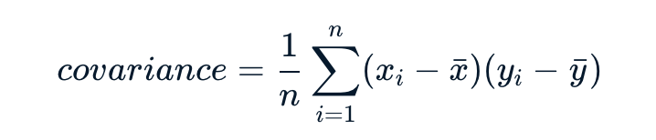
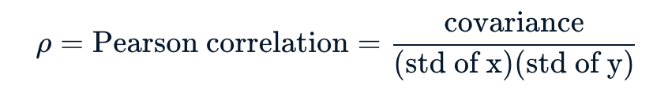

# Basic summary statistics 
## Covariance 
You can take the two variables that you are interested in, and generate a covariance metric by comparing the particular point to the means of both other variables. 

The covariance is the mean of the product of the differences for the two variables. If the values for a given data point are both above or both below the means, then the covariance is positive; this means that they are positively correlated. *When one is high, then so is the other. When one is low then so is the other.* 

## Pearson correlation
Remove the dimensions from the covariance metric to make it more widely comparable. 

By standardising using the standard deviation of the two vairables, we are making sure that we are comparing the variability due to codependence against the independent variability within those variables; this creates a range between -1 and 1. 
